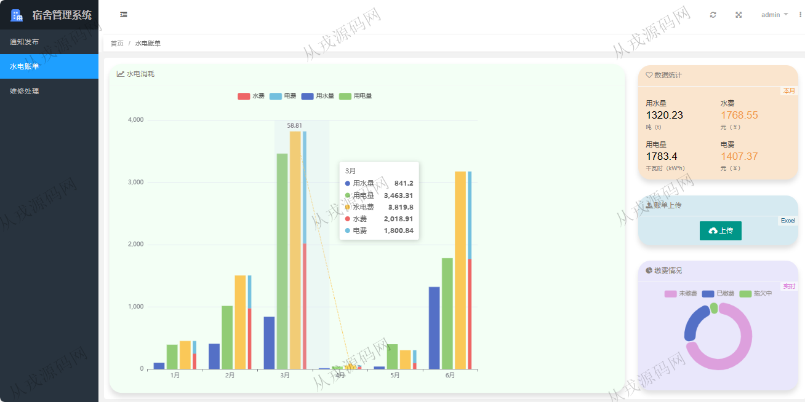
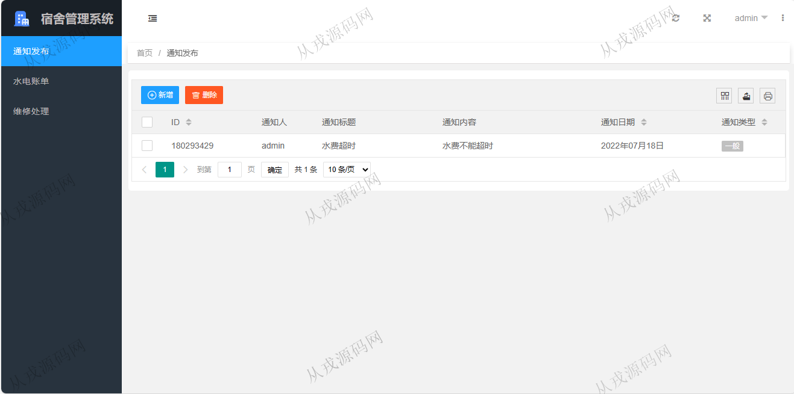
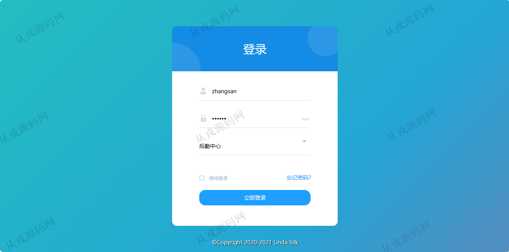
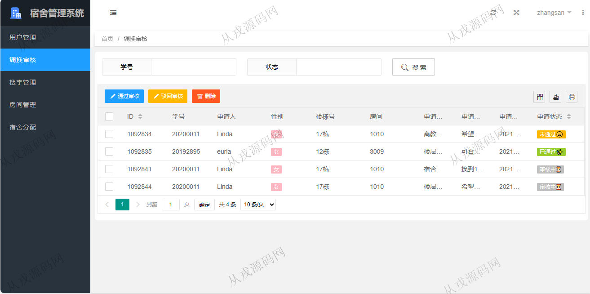
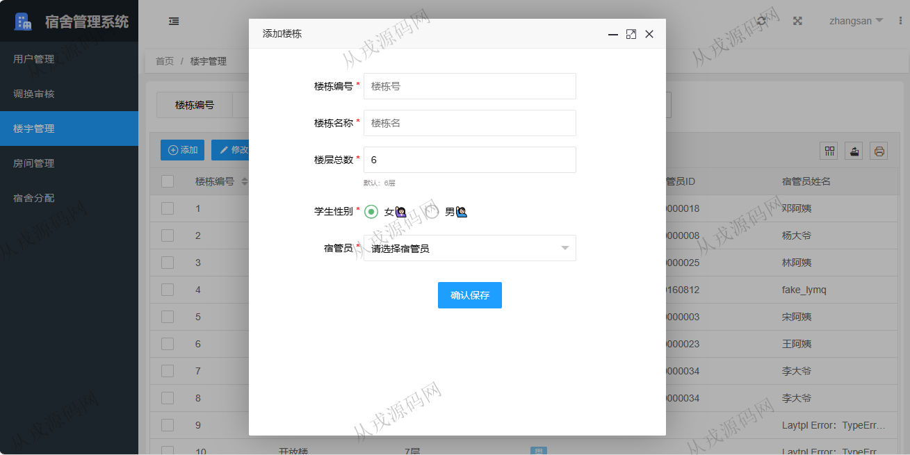
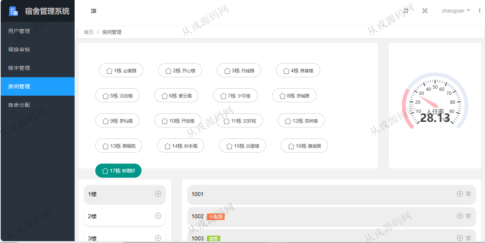
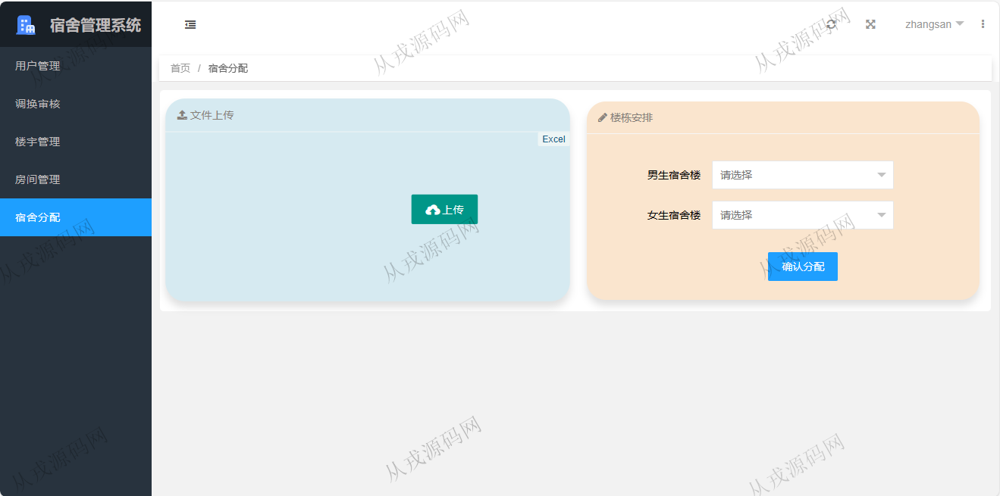
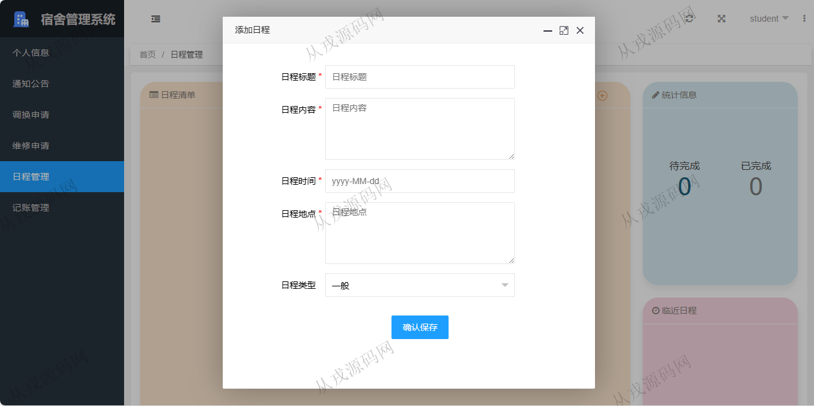

<h1 align="center">176.宿舍管理系统</h1>

- <b>完整代码获取地址：从戎源码网 ([https://armycodes.com/](https://armycodes.com/))</b>
- <b>技术探讨、资料分享，请加QQ群：692619798</b> 
- <b>作者微信：19941326836  QQ：952045282</b> 
- <b>承接计算机毕业设计、Java毕业设计、Python毕业设计、深度学习、机器学习</b>
- <b>选题+开题报告+任务书+程序定制+安装调试+论文+答辩ppt 一条龙服务</b>
- <b>所有选题地址 ([https://github.com/YuLin-Coder/AllProjectCatalog](https://github.com/YuLin-Coder/AllProjectCatalog)) </b>

## 项目介绍
基于springboot的宿舍管理系统：前端 html、layui，后端 springmvc、spring、mybatis；角色分为管理员，后勤，学生；集成房间管理，宿舍分配，调换申请等功能于一体的系统。

## 功能介绍

### 学生

- 通知公告：楼栋通知，房间通知，房间通知学生可以查看和发布
- 调换申请：申请列表查询，宿舍不合适，填写调换申请
- 维修申请：维修信息增删改查
- 日程管理：日程清单，统计信息， 临近日程
- 记账管理：当前余额，支出统计， 新增记账，近来走势，历史账单

### 管理员

- 通知发布：通知信息的增删查
- 水表账单：水电消耗（柱状图展示），数据统计，账单上传，缴费情况
- 维修处理：维修信息列表查询，按楼栋号和状态查询，完成维修，虚假报修处理，删除操作

### 后勤中心

- 用户管理：用户信息的增删改查，按学号工号查询，按姓名模糊查询
- 调换审核：学生提出调换申请，后勤查看与审核操作
- 楼宇管理：楼宇信息的增删改查
- 房间管理：按楼宇进行房间信息的增删改查，仪表盘显示入住率
- 宿舍分配：给学生分配宿舍

## 环境

- <b>IntelliJ IDEA 2021.3</b>

- <b>Mysql 5.7.26</b>

- <b>Tomcat 7.0.73</b>

- <b>JDK 1.8</b>

## 运行截图

